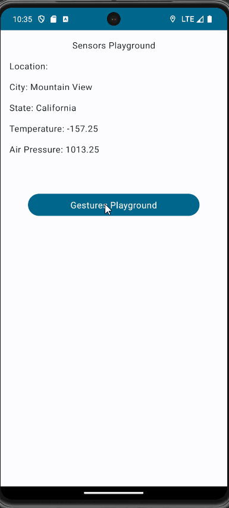

# Ball Gesture App

Small app where users can see various sensor values with a ball playground that can be controlled by tapping/moving on the screen.

## Functionality 

The following **required** functionality is completed:

* [ ] Various sensor values are shown including city, state, temperature, airpressure.
* [ ] User can navigate to the next activity by flinging on the button, clicking it does nothing.
* [ ] Ball can be moved by swiping on the screen. Movements are recorded.

The following **extensions** are implemented:

* Jetpack Compose
* Sensor API's

## Video Walkthrough

Here's a walkthrough of the program:

GIF created with [LiceCap](http://www.cockos.com/licecap/).

## Notes

Jetpack compose was much different from working with views. It was challenging at the start to determine how to do things that were rather easy in view in jetpack compose. Once we got the hang of it, it wasn't that difficult.

## License

    Copyright [2023] [Tip Browne, Ethan Deporter]

    Licensed under the Apache License, Version 2.0 (the "License");
    you may not use this file except in compliance with the License.
    You may obtain a copy of the License at

        http://www.apache.org/licenses/LICENSE-2.0

    Unless required by applicable law or agreed to in writing, software
    distributed under the License is distributed on an "AS IS" BASIS,
    WITHOUT WARRANTIES OR CONDITIONS OF ANY KIND, either express or implied.
    See the License for the specific language governing permissions and
    limitations under the License.

